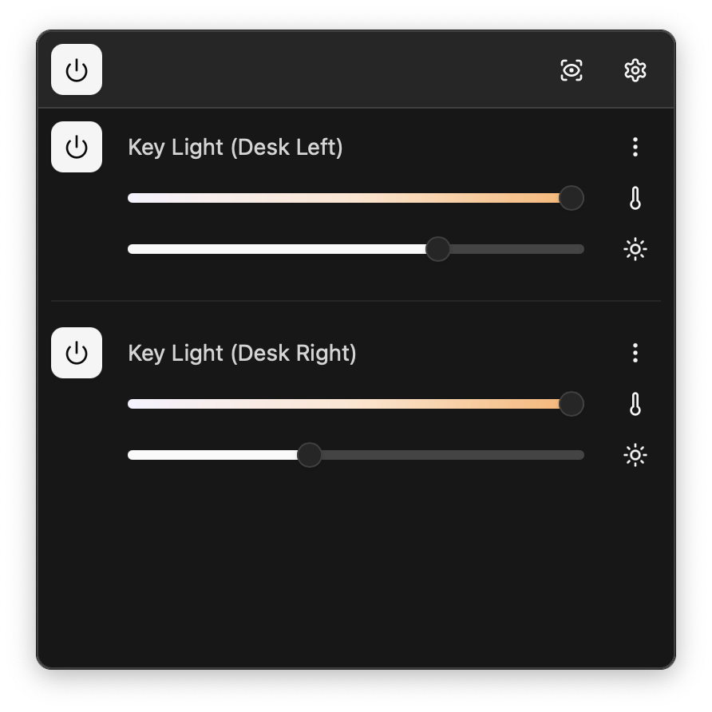
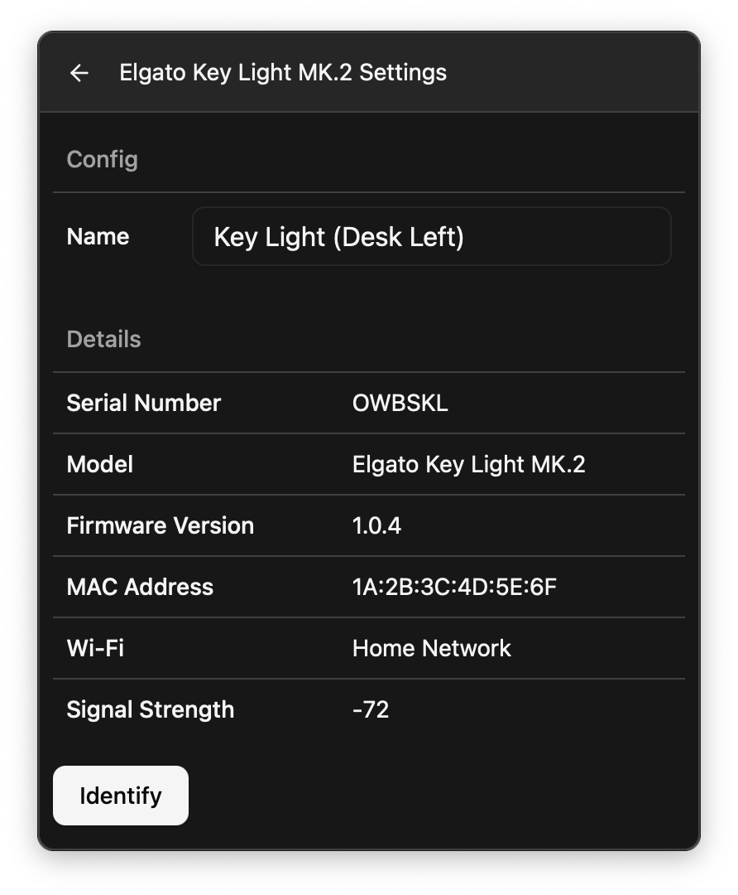
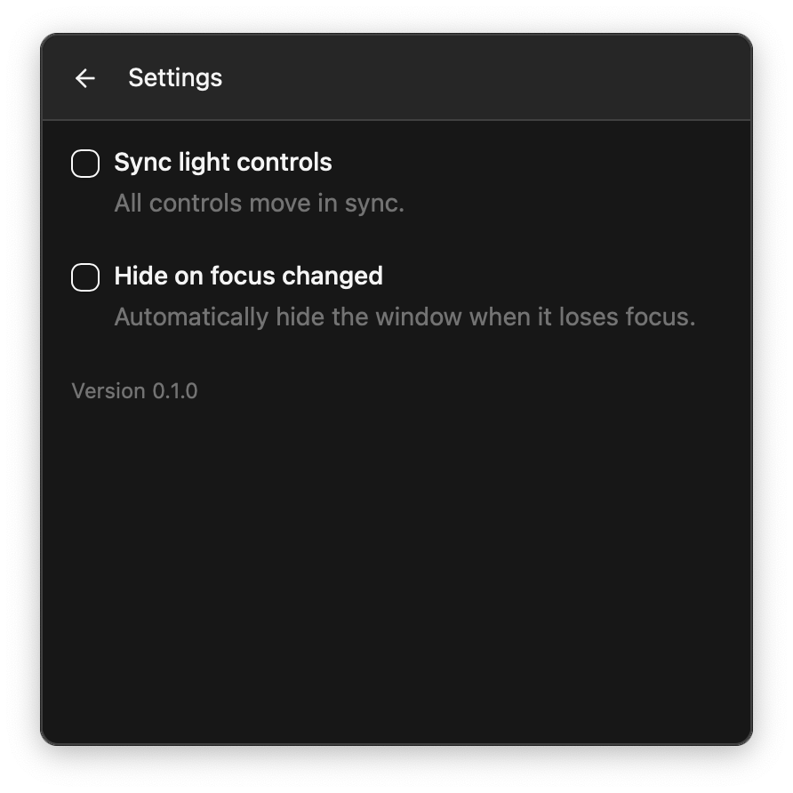

    

# Keylight Commander

Keylight Commander is an open-source and cross-platform application for controlling [Elgato Key Lights](https://www.elgato.com/us/en/p/key-light).

## Screenshots

    
    
    

## Features

- Support for macOS, Windows, and Linux
- Adjust brightness, color temperature, and power
- Sync adjustments to all lights
- Give lights nicknames
- Automatic light discovery via mDNS
- Uses minimal resources

## Installation

Download the [latest release](https://github.com/davidchalifoux/keylight-commander/releases/latest) for your platform and install it.

## Contributing

Contributions are welcome and highly appreciated. This project is using Tauri and React.

#### Recommended IDE Setup

- [VS Code](https://code.visualstudio.com/) + [Tauri](https://marketplace.visualstudio.com/items?itemName=tauri-apps.tauri-vscode) + [rust-analyzer](https://marketplace.visualstudio.com/items?itemName=rust-lang.rust-analyzer)
